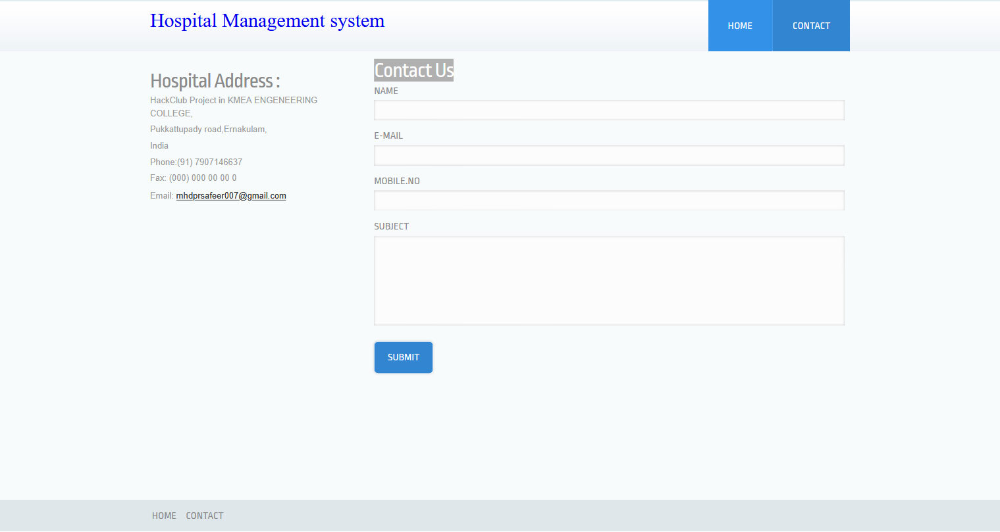
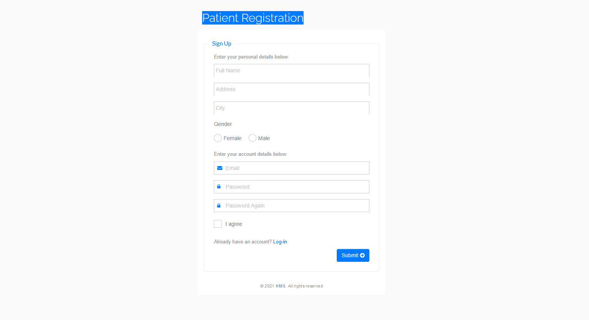
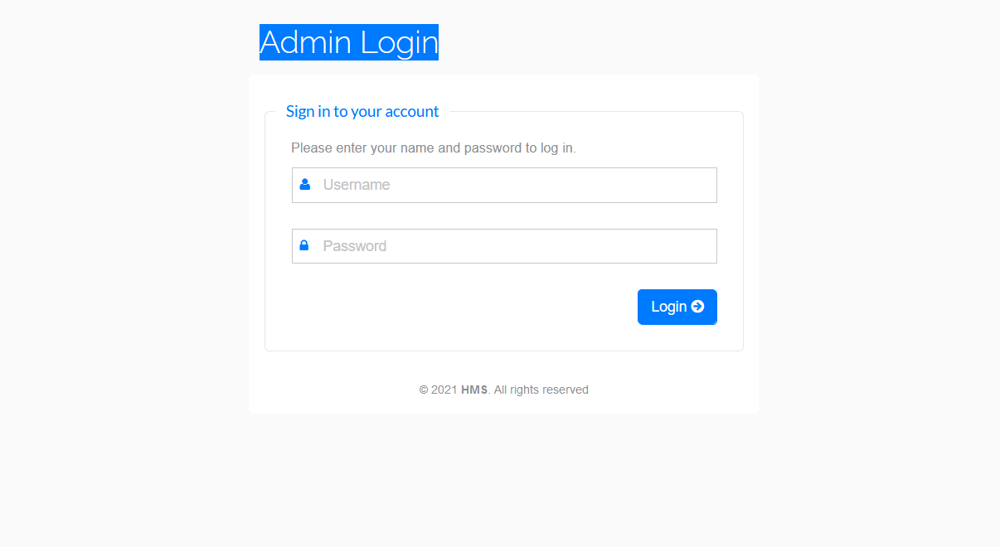
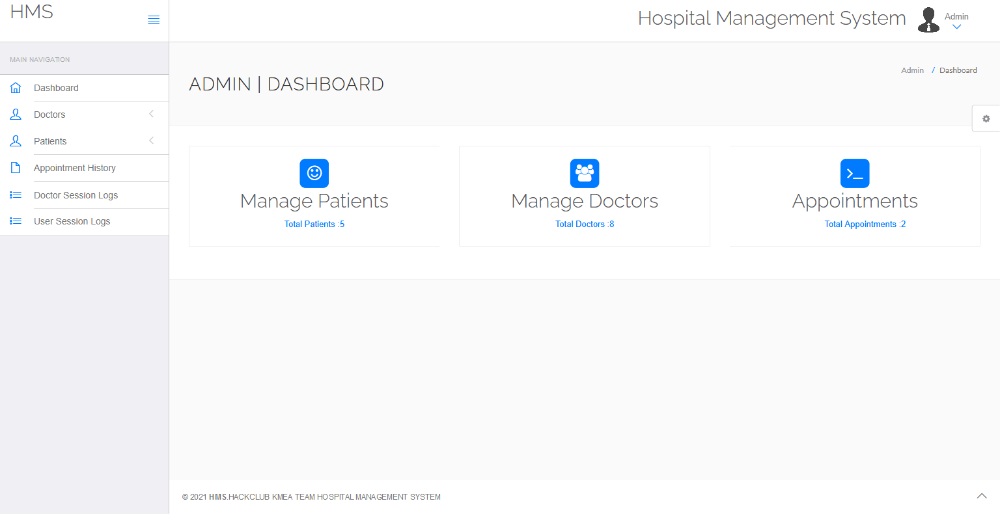
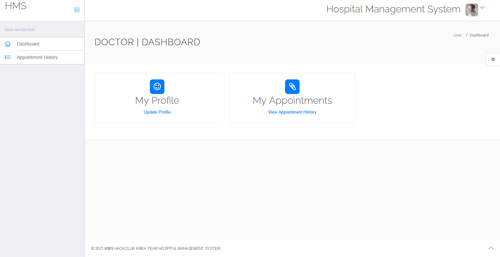
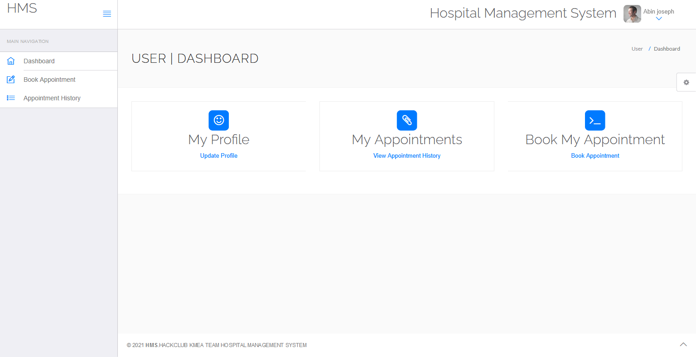

### Hospital Management System

---

## Technologies used 

---

 

--- 

#  Pages

## <a href="http://hackclubhms.42web.io/" target="_blank" >Home</a>

 

 

## <a href="http://hackclubhms.42web.io/contact.php" target="_blank" >Contact Us</a>

 

 

## <a href="http://hackclubhms.42web.io/hms/registration.php" target="_blank" >User Registration</a>

 

 

## <a href="http://hackclubhms.42web.io/hms/user-login.php" target="_blank" >Patient Login</a>

 

 
 
## <a href="http://hackclubhms.42web.io/hms/admin/" target="_blank" >Admin Login</a>

### Default Admin Username is : admin
### Default Admin Password is : password

 

 

## <a href="http://hackclubhms.42web.io/hms/doctor/" target="_blank" >Doctor Login</a>

### Using Admin Page create an Doctor

 

 

## Admin Dashboard

 

 

## Doctor Dashboard

 

 

## User Dashboard

 

 

---

# For more information contact me

---

 
 

---

<a href="http://hackclubhms.42web.io/" target="_blank" rel="noopener noreferrer">
<h1>
Visit The Website for Trial 
</h1>
</a>